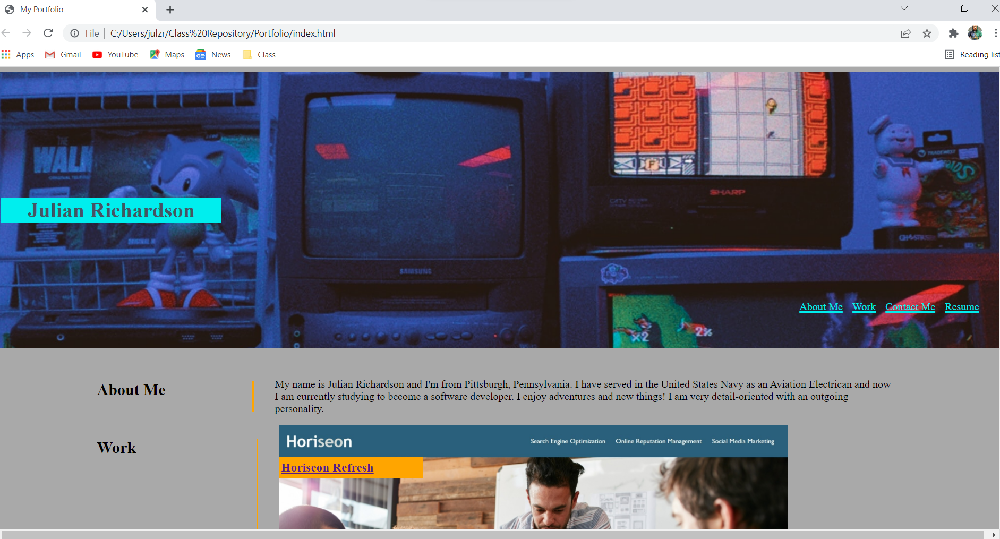

# Portfolio

# <Portfolio>
https://julianr3.github.io/Portfolio/
## Description

- Creating a personalized website to display new content in a creative way.
- Generating code in HTML and CSS for a very unique look.
- Easy-to-use beginner friendly design.

## Table of Contents

- [Installation](#installation)
- [Usage](#usage)
- [Credits](#credits)
- [License](#license)

## Installation

Easy navigation throughout the website, all resources one-click away. 

## Usage

Launch the website, and select between multiple navigational options listed at the top-right corner of the page for quick access to the selected section.

## Credits

Kyle Giuanta https://github.com/kgiunta
Isaak Morales https://github.com/CallMeIce

## License
Not Applicable

## Badges

